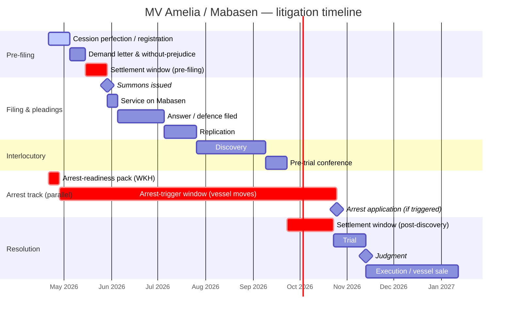

# MV Amelia litigation timeline — one-pager

Fill exact dates from Danie Malherbe before circulating. Durations below are placeholder working assumptions — do not present as firm.

## Mermaid Gantt (paste into any mermaid-aware renderer, or screenshot for the board pack)

## Key milestones for the board to track

| Milestone | Owner | Board visibility |
|---|---|---|
| Cession perfected | Danie | Report at every board until closed |
| Demand letter served | WKH | Update next board |
| Summons filed | WKH | Update next board |
| Answer received | WKH | Dictates next strategy inflection |
| Settlement window 1 (pre-filing) | CEO + WKH | Board sign-off on settlement floor |
| Arrest trigger | CEO + Danie | **Pre-authorised** per board decision |
| Discovery complete | WKH | Provisioning review |
| Settlement window 2 (post-discovery) | CEO + WKH | Board ratify |
| Trial / judgment | WKH | Final resolution reporting |

## Critical path

Cession → Arrest-readiness → Settlement windows.

The two settlement windows are where most cases resolve; the trial track is insurance, not the plan. The arrest track runs in parallel and is the primary source of negotiating leverage — collapses the moment the vessel leaves jurisdiction.

## Dependencies outside our control

- Mabasen's counsel response times (can add 30–60 days at answer / discovery)
- Court roll availability for trial date (NAM High Court — typically 6–9 months out from PTC)
- Vessel movement — outside our operational control; dictates whether arrest track stays live

## What this changes for today

If cession is **not** perfected, weeks 1–2 of the timeline collapse into weeks 1–2 of today. That's the number one ask from Danie this morning.
