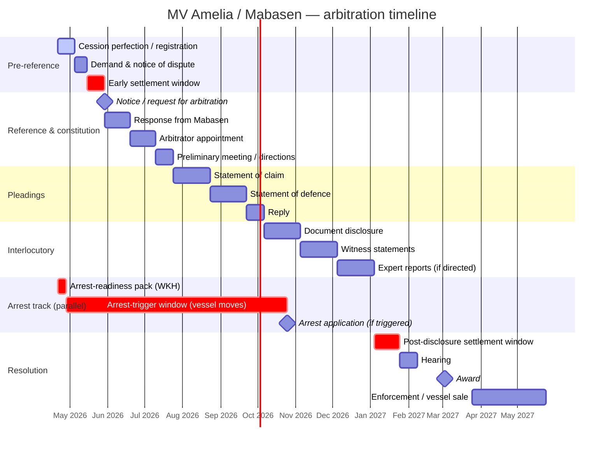

# MV Amelia arbitration — timeline one-pager

Arbitration track, not litigation. Fill exact dates from Danie Malherbe / WKH before circulating. Durations below are placeholder working assumptions drawn from typical AFSA / ad-hoc timetables — do not present as firm.

## Position at a glance

- **Merits:** we are well placed.
- **Vessel valuation:** N$100m unencumbered, confirmed.
- **Primary risk:** timing and enforcement execution (cession perfection, vessel jurisdiction) — not the merits.
- **Parallel admiralty track:** vessel arrest remains available as enforcement / negotiating leverage.

## Mermaid Gantt

## Key milestones for the board to track

| Milestone | Owner | Board visibility |
|---|---|---|
| Cession perfected | Danie | Report at every board until closed |
| Notice of arbitration issued | WKH | Update next board |
| Arbitrator appointed | WKH / parties | Update next board |
| Statement of defence received | WKH | First real read on Mabasen's posture |
| Early settlement window | CEO + WKH | Board sign-off on settlement floor |
| Arrest trigger | CEO + Danie | **Pre-authorised** per board decision |
| Post-disclosure settlement window | CEO + WKH | Board ratify |
| Award | WKH | Final resolution reporting |
| Enforcement / vessel sale | WKH + Danie | Recovery reporting |

## Critical path

Cession → arrest-readiness → settlement windows → award → enforcement.

Most arbitrations of this kind resolve in one of the two settlement windows once the other side has seen the claim and the disclosure. The award + enforcement path is insurance, backed by the N$100m vessel. The arrest track runs in parallel and collapses the moment the vessel leaves jurisdiction.

## Why arbitration (not litigation) matters for the board

- **Faster than High Court** — typically 9–15 months to award versus 18–30 months to first-instance judgment. Compresses the provisioning / write-back horizon.
- **Confidential** — no public record, reduces reputational spillover onto SIPIM / D9 conversations.
- **Narrow appeal grounds** — once we have an award, it is largely final. Enforcement is the game, not endless appeal rounds.
- **Cost profile** — arbitrator fees on our side, but offset by lower pleadings and motion burden. Ask WKH for the all-in comparison before finalising the arbitration budget ask.

## Dependencies outside our control

- Mabasen's counsel response times (can add 30–60 days at SOD / disclosure)
- Arbitrator availability for the hearing window
- Vessel movement — outside our operational control; dictates whether the arrest track stays live

## What this changes for today

If cession is **not** perfected, pre-reference weeks 1–2 collapse into today. That remains the number one ask from Danie this morning.
